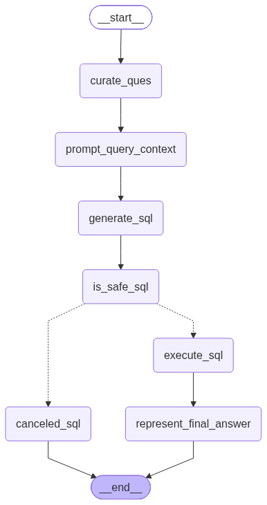

# 🤖 AI Data Agent

An end-to-end **multi-agent AI data analysis system** built with **LangChain, LangGraph, DeepSeek, PostgreSQL, Pandas, and Pydantic**.

The system accepts natural-language data requests and intelligently routes them to specialized agents for either:

* 🗄️ **SQL analytics** on PostgreSQL databases
* 🔄 **ETL operations** for extracting, transforming, and storing data

Instead of using one large agent for every task, the project follows a modular **agentic architecture** where specialized agents collaborate through LangGraph workflows.

---

## ✨ Key Features

### 🧠 Intelligent Agent Routing

The main **Data Agent** acts as an orchestrator.

It analyzes the user's request and automatically routes it to:

* **SQL Analyst Agent** — for database queries and analytics
* **ETL Analyst Agent** — for extraction and transformation workflows

Example:

```text
"Show me the top 5 drivers with the highest ratings"
                         ↓
                    Data Agent
                         ↓
                   SQL Analyst
```

```text
"Extract Pokemon data from this API and save it as CSV"
                         ↓
                    Data Agent
                         ↓
                   ETL Analyst
```

---

## 🏗️ Architecture

```text
                       ┌──────────────────────┐
                       │      User Query      │
                       └──────────┬───────────┘
                                  │
                                  ▼
                       ┌──────────────────────┐
                       │      Data Agent      │
                       │   Intent / Router    │
                       └──────────┬───────────┘
                                  │
                     ┌────────────┴────────────┐
                     │                         │
                     ▼                         ▼
          ┌────────────────────┐     ┌────────────────────┐
          │    SQL Analyst     │     │    ETL Analyst     │
          └─────────┬──────────┘     └─────────┬──────────┘
                    │                          │
                    ▼                          ▼
          ┌────────────────────┐     ┌────────────────────┐
          │ PostgreSQL + LLM   │     │ API / File /       │
          │ Query Workflow     │     │ Pandas Tools       │
          └────────────────────┘     └────────────────────┘
```

### Main Data Agent Graph


The router uses an LLM to classify every request as either `sql` or `etl`, after which LangGraph conditionally dispatches the request to the appropriate workflow.

---

# 🗄️ SQL Analyst Agent

The SQL Analyst converts natural-language questions into PostgreSQL queries, validates them before execution, executes approved queries, and converts database output back into a user-friendly answer.

## SQL Workflow

```text
User Question
      │
      ▼
Curate Question
      │
      ▼
Fetch Database Schema
      │
      ▼
Build SQL Context
      │
      ▼
Generate SQL Query
      │
      ▼
LLM Safety Judge
      │
 ┌────┴─────┐
 │          │
Safe      Unsafe
 │          │
 ▼          ▼
Execute    Cancel
 SQL       Query
 │
 ▼
Generate Final Answer
```

### SQL Analyst Graph



## SQL Agent Capabilities

The SQL agent can:

* Convert natural language into PostgreSQL
* Automatically inspect database schema information
* Read table names, columns and data types
* Include sample rows as context for the LLM
* Generate context-aware SQL queries
* Default to a maximum of 10 rows unless the user requests otherwise
* Execute approved queries using PostgreSQL
* Convert raw SQL results into human-readable responses

---

## 🛡️ SQL Safety Layer

Before a generated SQL query reaches PostgreSQL, it passes through an **LLM-based SQL Judge**.

The judge verifies that the query is intended only for data retrieval.

Queries containing potentially destructive operations such as:

```sql
INSERT
UPDATE
DELETE
DROP
ALTER
TRUNCATE
CREATE
```

are rejected by the workflow.

```text
Generated SQL
      │
      ▼
  SQL Judge
   /     \
 YES      NO
  │        │
Execute   Cancel
```

This adds a safety layer between LLM-generated SQL and the database.

> **Production note:** The current protection is primarily LLM-based. A production deployment should additionally use database-level read-only credentials, SQL parsing/allowlisting, execution timeouts, and query limits.

---

# 🔄 ETL Analyst Agent

The ETL Analyst handles data extraction and transformation tasks through an LLM tool-calling workflow.

It can decide which ETL tool is required, invoke the tool, observe its result, and continue the conversation until the task is complete.

## ETL Workflow

```text
User Request
     │
     ▼
   LLM Node
     │
     ▼
Tool Required?
   /     \
 YES      NO
  │        │
  ▼        ▼
Tool Node  END
  │
  └──────────► LLM Node
```

### ETL Analyst Graph


## ETL Capabilities

### API Extraction

The ETL agent can retrieve JSON data from REST APIs and normalize it into structured tabular data.

Supported output formats:

```text
CSV
JSON
Parquet
```

Example request:

```text
Extract data from:
https://pokeapi.co/api/v2/pokemon

and save it in CSV format.
```

### Data Transformation

The agent can inspect an existing dataset, understand the requested transformation, generate Pandas code, execute the transformation, and save the resulting dataset.

Supported input formats include:

```text
.csv
.json
.parquet
```

Example:

```text
Filter all rides where the fare is greater than 500
and save the result as CSV.
```

---

## 🧠 LLM Selection

The project provides a centralized LLM selector through:

```text
utils/llm_pick.py
```

The current implementation uses **DeepSeek models through the OpenAI-compatible API interface**.

```text
low     → deepseek-chat
medium  → deepseek-reasoner
high    → deepseek-reasoner
```

This keeps model selection separate from individual agent logic and makes it easier to change models as the system evolves.

---

# 🧰 Tech Stack

| Technology | Purpose                           |
| ---------- | --------------------------------- |
| Python     | Core application                  |
| LangChain  | LLM abstractions and tool calling |
| LangGraph  | Agent workflow orchestration      |
| DeepSeek   | Language and reasoning models     |
| PostgreSQL | Structured database               |
| Psycopg2   | PostgreSQL connectivity           |
| Pandas     | ETL and data transformation       |
| Pydantic   | Agent state schemas               |
| Requests   | REST API extraction               |
| uv         | Python dependency management      |

---

# 📂 Project Structure

```text
Ai_Data_Agent/
│
├── agents/
│   ├── data_agent.py
│   ├── sql_analyst.py
│   └── etl_analyst.py
│
├── Models/
│   └── schema.py
│
├── utils/
│   ├── database.py
│   ├── db_connection.py
│   ├── etl_tools.py
│   ├── feed_db.py
│   └── llm_pick.py
│
├── data/
│   ├── extract/
│   ├── users.csv
│   ├── vehicles.csv
│   ├── rides.csv
│   ├── payments.csv
│   └── ratings.csv
│
├── src/
│   └── data_agent/
│
├── data_agent_graph.png
├── sql_analyst_graph.png
├── etl_analyst_graph.png
│
├── pyproject.toml
├── uv.lock
├── main.py
└── README.md
```

---

# 📊 Sample Dataset

The project contains a sample ride-sharing dataset with relational tables for:

```text
users
vehicles
rides
payments
ratings
```

The dataset allows the SQL agent to demonstrate joins, aggregations, filtering, ranking, payment analytics, ride analytics, user analytics, and driver-rating queries.

---

# ⚙️ Installation

## 1. Clone the Repository

```bash
git clone https://github.com/RecursiveOm/Ai_Data_Agent.git
cd Ai_Data_Agent
```

## 2. Install uv

If `uv` is not already installed, follow the official installation instructions:

https://docs.astral.sh/uv/

## 3. Install Dependencies

```bash
uv sync
```

The project requires **Python 3.12 or later**.

---

# 🔐 Environment Variables

Create a `.env` file in the project root:

```env
DEEPSEEK_API_KEY=your_deepseek_api_key

host=localhost
port=5432
database=your_database_name
user=postgres
password=your_postgresql_password
```

Never commit your `.env` file or API keys to GitHub.

---

# 🐘 PostgreSQL Setup

Create a PostgreSQL database and update the `.env` values accordingly.

The repository includes a database initialization script that creates the required tables and loads the sample CSV datasets.

Run:

```bash
uv run python utils/feed_db.py
```

The script creates the required PostgreSQL schema and loads the sample:

```text
users
vehicles
rides
payments
ratings
```

datasets.

---

# 🚀 Running the Project

The main orchestration graph is available from:

```text
agents/data_agent.py
```

You can test the existing example with:

```bash
uv run python agents/data_agent.py
```

You can also invoke the agent programmatically:

```python
from agents.data_agent import data_agent
from langchain_core.messages import HumanMessage

response = data_agent.invoke(
    {
        "messages": [
            HumanMessage(
                content="Show me the top 5 drivers with the highest ratings"
            )
        ],
        "route_response": ""
    }
)

print(response["messages"][-1].content)
```

---

# 💡 Example Queries

## SQL Analytics

```text
Which payment methods are used the most?

Show me the top 5 drivers by average rating.

What is the average ride fare?

Which users have completed the most rides?

Show the highest-value completed rides.
```

The router recognizes these as database analytics requests and forwards them to the SQL Analyst Agent.

## ETL Operations

```text
Extract Pokemon data from the PokeAPI and save it as CSV.

Convert this JSON dataset into CSV.

Filter the rides dataset where fare > 500.

Transform the dataset and save the output as Parquet.
```

These requests are routed to the ETL Analyst Agent.

---

# 🔄 Agent State Management

Pydantic models are used to define and validate the state passed between LangGraph nodes.

Important state models include:

```text
AgentSchema
JudgeSchema
ETLAgentSchema
RouterSchema
DataAgentSchema
```

The SQL state keeps information such as:

```text
Original user question
Curated question
Database context
Generated SQL
Safety decision
Execution result
Final answer
```

This makes each stage of the workflow explicit and easier to debug.

---

# 🔍 What This Project Demonstrates

This project demonstrates practical concepts used when building production-oriented AI systems:

* Agentic AI architecture
* Multi-agent orchestration
* LLM-based intent routing
* Tool calling
* Conditional LangGraph workflows
* Natural-language-to-SQL systems
* Dynamic database schema grounding
* LLM-as-a-Judge patterns
* AI safety layers
* ETL automation
* LLM-generated Pandas transformations
* Pydantic state management
* PostgreSQL integration
* Model abstraction and routing

---

## ⭐ Support

If you find this project useful or interesting, consider giving the repository a ⭐.

Contributions, suggestions, and improvements are welcome.
